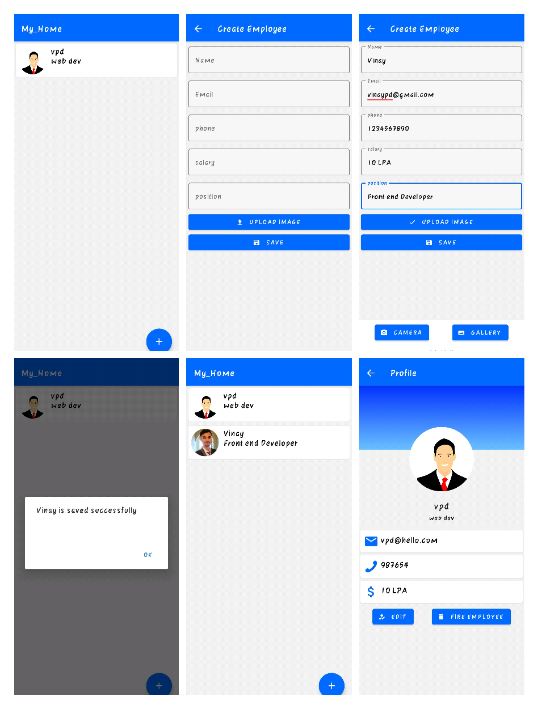

# Employee-Android-App
A simple employee management tool that can store & list information of all employees in an organisation. 
● Application stack: MongoDB, Express Js, React Native, Node Js, Expo Cli 
● Features: Employees listing, Employee details, CRUD of an employee

# screens

# Development

This project doesn't require basic react native setup to get up and running.  
Install the expo-sdk and get started. Read more about expo at https://expo.io 
Run the below commands in sequence to start the development server in expo. 
In order to start the development server without expo, read the React Native docs at https://reactnative.dev

1. git clone https://github.com/Vinaypd7/Employee-Android-App.git
2. cd Employee-Android-App
3. npm i expo
4. expo install or npm install
5. expo start
